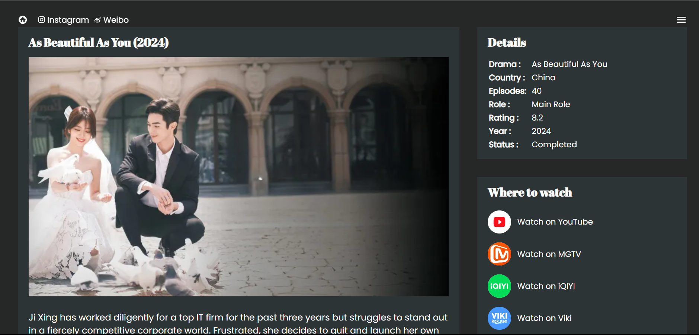

[Live Link](https://xu-kai.netlify.app/)

# XU Kai Chinese Actor

A website for Xu kai's filmography.




## Tech Stack

- Astro
- CSS
- JavaScript

<!-- ## Features

- xyz
- -->

## How to use

1. Clone the repo

```bash
git clone https://github.com/techdhara047/xu-kai
```

2. Install dependencies

```bash
npm install
```

3. Start the dev server

```bash
npm run dev
```

## Contributing

Pull requests are welcome. For major changes, please open an issue first to discuss what you would like to change.

## License

This project is open source and available under the [MIT License](LICENSE).
